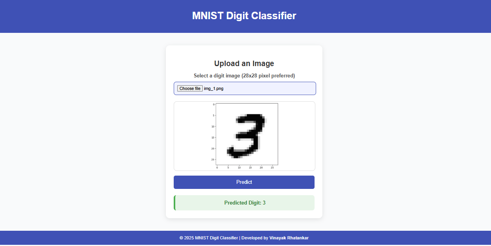
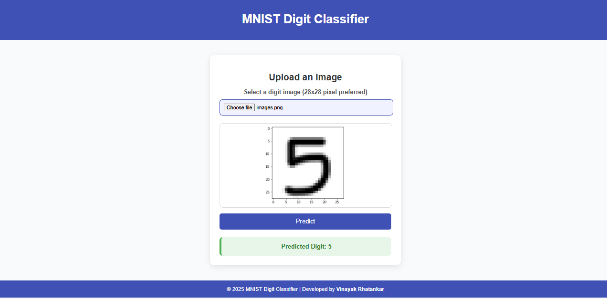

# 🔢 MNIST Digit Recognition using ANN

An elegant and beginner-friendly **Artificial Neural Network (ANN)** project for recognizing handwritten digits (0-9) using the **MNIST dataset**. This project leverages **Python**, **Flask**, and **TensorFlow/Keras**, providing an interactive web interface to predict digits from images in real-time.

---

## 🌟 Overview
Digit recognition is one of the fundamental problems in computer vision and deep learning. The **MNIST dataset** serves as a benchmark for testing and comparing machine learning models. 

This project builds a **feedforward neural network (ANN)** to classify digits into 10 categories. The trained model can be integrated into web apps and deployed to production environments with ease.

---

## 🧾 Theoretical Background
### **1. What is ANN?**
An **Artificial Neural Network (ANN)** is a computational model inspired by the human brain. It consists of interconnected layers of nodes (neurons) that process information.

Key components:
- **Input Layer:** Accepts the raw image data (28x28 pixels flattened to 784 values).
- **Hidden Layer:** Extracts complex patterns using activation functions like ReLU.
- **Output Layer:** Produces probabilities for each digit (0-9) using Softmax.

### **2. MNIST Dataset**
The MNIST dataset is a collection of **70,000 handwritten digit images**:
- **60,000 training images**
- **10,000 testing images**
- Each image is **28x28 grayscale pixels**.

It is widely used for experimenting with new image classification algorithms.

### **3. Why ANN for MNIST?**
Although Convolutional Neural Networks (CNNs) are commonly used for image recognition, a simple ANN is effective for MNIST due to:
- The simplicity and small size of the dataset.
- Easy implementation and faster training.
- A great starting point for understanding deep learning concepts.

---
## 🖼 Example Predictions
The model takes an input image and predicts the digit class:

| Digit 3 Prediction | Digit 5 Prediction |
|--------------------|--------------------|
|  |  |

---
## 🛠 Tech Stack
| Technology     | Purpose |
|----------------|---------|
| **Python** 🐍    | Core programming language for implementation |
| **Flask** 🌐      | Web framework for building an interactive interface |
| **TensorFlow/Keras** 🧠 | Model creation, training, and evaluation |
| **NumPy & Pandas** 📊 | Data manipulation and preprocessing |
| **Matplotlib/Seaborn** 📈 | Visualization of performance metrics |
---

## 🧠 Model Architecture
The ANN model consists of three layers:

| Layer Type       | Output Shape | Parameters | Description |
|------------------|--------------|------------|-------------|
| **Flatten**      | (None, 784)  | 0 | Converts the 28x28 image into a 1D vector |
| **Dense (128)**  | (None, 128)  | 100,480 | Fully connected hidden layer with ReLU activation |
| **Dense (10)**   | (None, 10)   | 1,290 | Output layer with Softmax activation for digit classification |

**Total Parameters:** 101,770 (~397 KB)

### Key Highlights:
- **ReLU Activation:** Introduces non-linearity for effective learning.
- **Softmax Activation:** Converts outputs into probability distributions.
- **Optimizer (Adam):** Efficient gradient-based optimization.
- **Loss Function (Sparse Categorical Crossentropy):** Ideal for multi-class classification.

---

## 📊 Training & Evaluation
- **Training Data:** 60,000 digit images.
- **Testing Data:** 10,000 digit images.
- The model learns to identify distinct features for each digit.

During training, we monitor:
- **Accuracy:** Measures how well the model predicts correct digits.
- **Loss:** Measures how far off the predictions are from the actual labels.

The final trained model achieves **high accuracy**, making it reliable for digit recognition tasks.

---

## 🚀 Future Enhancements
- **Add Dropout Layers:** Improve generalization and reduce overfitting.
- **Upgrade to CNN:** For more complex image recognition tasks.
- **Real-time Drawing Board:** Allow users to draw digits directly on the interface.
- **Cloud Deployment:** Deploy the model to AWS, GCP, or Azure.

---

## 📜 License
This project is licensed under the MIT License.

---
